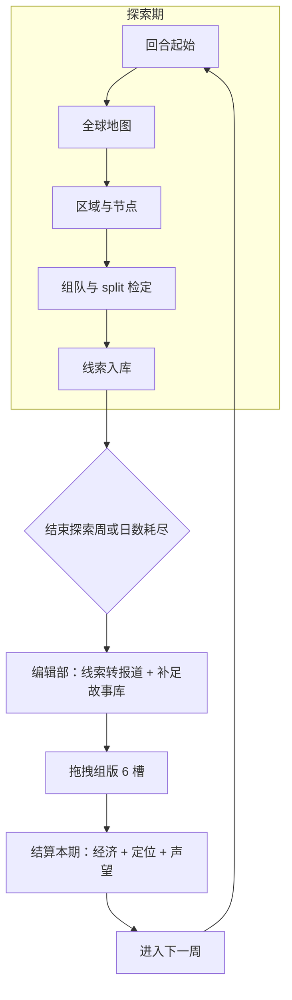

# 《世界未解之谜周刊》全链条版 — 设计文档汇总

> **版本**：v1.1（与当前仓库「探索 → 骰子检定 → 线索成稿 → 报刊组版 → 经济结算」网页 Demo 对齐）  
> **文档性质**：总览与索引；细则仍以分册文档为准，避免多处重复维护时产生矛盾。

---

## 1. 文档索引（本版涉及的全部设计文档）

| 文档 | 路径 | 内容侧重 |
|------|------|----------|
| **系统功能设计总集（母文档·需与落地同步）** | `设计文档/系统功能设计总集.md` | 全系统汇总目录、分册交叉链接、全链原型 §13 对照、维护约定 |
| **本文** | `docs/世界未解之谜周刊_全链条版设计文档汇总.md` | 全链条流程、模块衔接、实现文件、术语对照 |
| 探索部分（区域/宏观/时间） | `docs/世界未解之谜周刊_探索部分设计文档.md` | 全球/区域、筛选回收、宏观五维、**早期 Demo 曾用 d6 描述**；全链条实现已改为 **split 二项检定**（见 §4、§5） |
| 骰子判定（最终版） | `docs/骰子判定玩法_最终版.md` | 二项分布、难度→p、单属性/综合/split、对手作废骰子、纯数值/骰子表现 |
| 故事合成与报道编写 | `docs/故事合成与报道编写系统设计文档.md` | 现象牌/认知牌体系、认知升级链、四类合成公式、报道四维属性、风险与污染、对组版结算接口 |
| 报刊结算与出版（原型） | `docs/报刊结算出版玩法设计文档.md` | 故事结构、6 版位、拖拽预览、三轴占比、`editorialProfile`、需求与收入成本公式 |
| 事件检定（苏丹式扩展） | `docs/事件检定系统设计文档.md` | 与报刊主线并行参考；多骰二项、对抗等 **通用检定框架** |
| 策划配置表模板 | `docs/策划配置表模板_事件检定字段.md` | Excel/表结构字段约定 |
| 事件脚本示例 | `docs/事件脚本示例_3个事件配置与期望体验.md` | 示例配置与体验描述 |

**外部/他处备忘（不在本仓库则仅引用）**

- `DESIGN-BRIEF.md`：NEWS TOWER + 苏丹式叙事、编辑部未实现能力清单。  
- Excel《安格斯准正式文档》：完整数值与编辑规则；**以 Excel 为权威时，文档与 Demo 仅为原型基线**。

---

## 2. 全链条玩法一览（本版网页实现）

玩家在一轮「周」内依次经历：

1. **探索期**：回合简报 → 全球地图（筛选、回收噪音）→ 区域节点 → 选 1–3 名职员 → **split 骰子检定** → 获得 **线索**（`title` / 探索标签类型 / 档位 `tier`）。  
2. **进入编辑部**：手动「结束探索周」或 **剩余日数耗尽** 自动进入。  
3. **线索成报道**：将本周 **探索线索** 映射为报刊 **故事**（题材标签 + 质量档 + `baseValue` + 负面等），并按设定条数 **用随机都市报道补足** 故事库。  
4. **报刊组版**：拖拽报道到 **6 个版位**，支持覆盖、移除、清空；悬停显示利润/销量等预览与连携高亮。  
5. **结算本期**：按 `docs/报刊结算出版玩法设计文档.md` 的公式计算需求、销量、订阅、广告、成本与**净利润**；更新 **订阅数**、**编辑定位** `editorialProfile`；并给予与本周探索稿数量相关的 **声望** 小幅奖励。  
6. **本周流程完成** → **进入下一周**，回到步骤 1；**订阅与编辑定位跨周继承**，**五维宏观**跨周继承。



---

## 3. 模块设计要点（摘要）

### 3.1 探索与世界地图

- **宏观属性**：公信、诡名、声望、守序、狂性（0–100）；对冲关系与狂性不可逆等 **设计约束** 见 `世界未解之谜周刊_探索部分设计文档.md` §3。  
- **时间**：每周 7 日；节点消耗 `days`；不足则不可执行。  
- **区域/节点**：常驻 / 临时 / 隐藏；解锁条件、筛选标签（科学纪实 / 神秘玄学 / 世俗流量）、回收噪音等 —— **细则见探索分册**。

### 3.2 探索检定（本实现：split + 二项分布）

与 `docs/骰子判定玩法_最终版.md` **§3.3 分别多属性（split）** 对齐：

- **调查池**：职员 **探索 + 洞察 + 诡思** 之和 → 骰数 \(n_A\)；阈值 \(k_A\) 为对应需求之和。  
- **现场池**：**生存 + 理性** 之和 → \(n_B\)；阈值 \(k_B\) 为对应需求之和。  
- **难度 → 单骰成功率 \(p\)**：简单 0.60 / 普通 0.50 / 困难 \(1/3\)；叠加 Δp（未达门槛、临时节点、隐藏节点等）。  
- **对手 `enemyAttr`**：在已投骰子中按两池比例 **随机无放回作废**，再比 \(X \ge k\)（与最终版文档 **§4** 一致）。  
- **结果档位**：双过 → **大成功**；仅一侧过 → **小成功**；双不过 → **失败**；极端情况可判 **大失败**（实现中有额外规则）。  
- **表现**：**骰子**（两阶段展示）/ **纯数值** 可切换，随机逻辑相同。

> **说明**：`世界未解之谜周刊_探索部分设计文档.md` 中仍保留 **d6 单机 Demo** 的公式描述，属于历史版本；**全链条版以 split 二项 + `world-mysteries-full-chain.js` 为准**。

### 3.3 线索 → 报刊故事（衔接规则）

| 探索侧 | 报刊侧（与 `报刊结算出版玩法设计文档.md` 兼容） |
|--------|-----------------------------------------------|
| 线索 `title` | 报道标题（保留探索文案） |
| 线索 `type`：`sci` / `occult` / `pop` | 映射为英文题材标签（如 Politics / Gossip / Shopping），再参与三轴与连携 |
| 线索 `tier`：1–3 | 映射 **Bronze / Silver / Gold** 与 `baseValue`（150 / 300 / 450） |
| — | 可附加随机第二标签、负面标签（规则同报刊文档 §2.3） |

补足稿件：按 **8 / 10 / 12** 择一，取 **`max(所选条数, 本周探索线索条数)`**，不足部分用 **随机都市报道生成**（标题模板、标签与负面规则见报刊文档 §2）。

### 3.4 报刊组版与经济结算

- **版位、拖拽、预览、Toast 撤销、实时统计**：见 `报刊结算出版玩法设计文档.md` §1–§7。  
- **三轴（P/M/L）、`editorialProfile`、需求乘数、销量、订阅、广告、成本、利润**：见同文档 **§4–§6** 与 **§10 常量表**。  
- **本版增量**：结算完成后展示「本周流程完成」，**进入下一周** 清空本周编辑部临时状态，回到探索；**声望** 在结算时按本周探索转化条数小幅增加（具体以代码为准）。

---

## 4. 实现文件与维护方式（避免乱码）

| 文件 | 说明 |
|------|------|
| `world-mysteries-full-chain.html` | **玩家打开的单文件**：UTF-8 **带 BOM** 为宜，便于 Windows 下浏览器 `file://` 正确识别中文。 |
| `world-mysteries-full-chain-head.htm` | 静态 HTML 壳（标题、样式、探索/编辑部/摘要 DOM）；**仅含正确 UTF-8 中文**。 |
| `world-mysteries-full-chain.js` | 全部逻辑；与 head 合并生成最终 HTML。 |

**重建合并示例（PowerShell，勿用错误编码读取）：**

```powershell
$utf8bom = New-Object System.Text.UTF8Encoding $true
$utf8 = [System.Text.UTF8Encoding]::new($false)
$head = [System.IO.File]::ReadAllText('d:\angos\world-mysteries-full-chain-head.htm', $utf8)
$js = [System.IO.File]::ReadAllText('d:\angos\world-mysteries-full-chain.js', $utf8)
$out = $head + $js + "`r`n</script>`r`n</body>`r`n</html>`r`n"
[System.IO.File]::WriteAllText('d:\angos\world-mysteries-full-chain.html', $out, $utf8bom)
```

---

## 5. 分册文档与全链条的对应关系

| 主题 | 全链条中的位置 | 主要依据文档 |
|------|----------------|----------------|
| 世界观与编辑部长期未实装项 | 不在本网页内 | `DESIGN-BRIEF.md`、Excel |
| 探索地图与宏观 | 探索期 | `世界未解之谜周刊_探索部分设计文档.md`（检定数学以本文 §3.2 为准） |
| 骰子数学与表现 | 探索结算 | `骰子判定玩法_最终版.md` |
| 报道字段、版位、经济公式 | 编辑部 | `报刊结算出版玩法设计文档.md` |
| 通用事件检定扩展 | 可选后续 | `事件检定系统设计文档.md` 等 |

---

## 6. 版本记录

| 版本 | 日期 | 说明 |
|------|------|------|
| v1.0 | 2026-03 | 整合探索分册、骰子最终版、报刊结算文档与全链条 Demo 流程说明 |
| v1.1 | 2026-03 | 明确 split 检定为全链条实现标准；补充实现文件与 UTF-8 合并说明；建立与探索分册 d6 描述的差异说明 |

---

**全文完。** 若需将本汇总拆入 Excel《安格斯准正式文档》或主策划案，建议只引用 **§2 流程** 与 **§3 衔接表**，细节仍链接至各 `docs/*.md` 分册。
