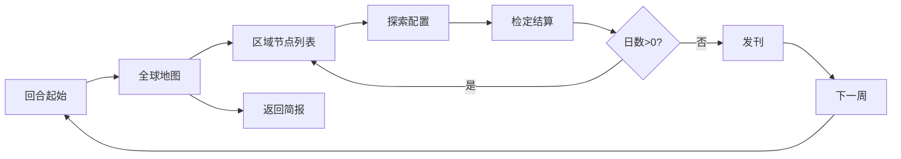

# 《世界未解之谜周刊》——探索部分设计文档

> **版本**：v1.0（与 `world-mysteries-weekly-demo` 单机网页 Demo 对齐，并补全可扩展的设计说明）  
> **关联文档**：`DESIGN-BRIEF.md`（整体定位与编辑部衔接）、Excel《安格斯准正式文档》（完整数值与编辑规则，需人工对照）  
> **不在本文范围**：认知合成 UI、报道四属性、版面 Combo、势力强制刊登、报社楼层、存档持久化（见 Brief「未实现」清单）

---

## 1. 文档目的

- 把 **探索循环**（全球 → 区域 → 派遣 → 检定 → 线索产出 → 周结算）写成可给程序/策划对照的规格。
- 明确 **宏观属性**、**地图与节点**、**筛选与回收**、**队伍与 d6 检定**、**线索数据结构** 及 **与编辑部系统的接口预留**。

---

## 2. 游戏定位（探索在整体中的位置）

- **节奏**：NEWS TOWER 式「周刊/回合」时间盒；探索消耗 **本周剩余日数**，日数用尽或玩家主动 **结束本周** 后进入发刊（极简版仅结算销量与声望等）。
- **叙事驱动**：苏丹式「卡牌/线索」驱动；探索产出 **线索素材**，供后续 **认知合成 → 报道**（完整版规则见准正式文档，Demo 未实现合成 UI）。
- **主角身份**：小众周刊主编；探索侧表现「全球/区域选点 → 派人 → 拿料」。

---

## 3. 宏观属性（周刊维度）

| 属性 | 范围 | 说明（探索侧影响） |
|------|------|-------------------|
| 公信 | 0–100 | 影响部分区域解锁（如观测合作）；与 **诡名** 对冲叙事倾向 |
| 诡名 | 0–100 | 隐藏节点、神秘向奖励；与 **公信** 对冲 |
| 声望 | 0–100 | 区域解锁条件之一；探索成败与发刊会反馈声望 |
| 守序 | 0–100 | 大失败等会打击守序；与 **狂性** 对冲 |
| 狂性 | 0–100 | 隐藏节点可见条件；大成功/失败会变动；**原则上不可逆**（仅允许临时抑制类效果，Demo 未实现抑制） |

**设计约束（Brief）**

- **公信 ↔ 诡名**、**守序 ↔ 狂性** 为对冲轴；策划配置事件与结算时需避免单轴无限膨胀无代价。
- 探索结算、回收噪音、发刊极简公式等 **以 Excel 准正式文档为准**；本文记录 Demo 中的 **示例数值** 便于对照实现。

---

## 4. 时间结构：周与日

- **每周 7 日**：`day` 初值 7，执行探索节点时扣除 `node.days`（耗时）。
- **日数不足**：若 `node.days > day`，禁止执行（需换节点或结束本周）。
- **结束本周**：
  - **自然耗尽**：`day` 扣至 ≤0 时自动进入发刊结算。
  - **手动结束**：玩家点击「结束本周并发刊」，将剩余日数视为编辑部工时，**立即** `day = 0` 并发刊（Demo 日志仅记录，不额外折算属性）。
- **新一周**：周序号 +1，`day` 重置为 7；**线索列表清空**（Demo）；**回合起始事件**重新随机；**狂性不自动下降**。

---

## 5. 探索流程（状态机）

| 视图/阶段 | 玩家行为 | 系统行为 |
|-----------|----------|----------|
| 回合起始 | 阅读本周随机事件与势力提示 | 可随机一条「回合事件」文案（Demo 仅展示，部分事件未绑定数值） |
| 全球地图 | 切换线索筛选、可选「回收噪音」、点选已解锁区域 | 按筛选高亮区域可探索目标数；未解锁区域不可点 |
| 区域 | 点节点「配置队伍」 | 隐藏节点按条件显示；临时节点显示截止说明；链式未解锁节点禁用 |
| 探索配置 | 选 1–3 名职员 | 显示累计属性是否满足需求、**基础成功率**估算 |
| 检定结算 | 看 d6 与结果档 | 扣日、改宏观、生成线索条目 |
| 发刊（极简） | 进入下一周 | 按线索数量等估算「销量指数」、声望微调 |

---

## 6. 全球层

### 6.1 区域（Region）

**数据字段（建议配置表列）**

| 字段 | 类型 | 说明 |
|------|------|------|
| `id` | string | 唯一标识 |
| `name` | string | 显示名 |
| `unlocked` | bool | 是否可进入（可由条件动态计算） |
| `pulse` | bool | 是否显示「可探索」高亮动画（如新解锁提示） |
| `hint` | string | 解锁条件说明文案 |
| `nodes` | array | 见 7 节 |

**Demo 解锁规则（示例，可配置化）**

| 区域 ID | 名称 | 解锁条件 |
|---------|------|----------|
| `us` | 北美禁区带 | 默认解锁 |
| `east_asia` | 东亚神秘地带 | `声望 ≥ 55` **或** 已持有标题含「罗斯威尔」的线索 |
| `pacific` | 太平洋岛屿群 | `公信 ≥ 60` **或** `守序 ≥ 60` |

### 6.2 线索筛选（对标 News Tower 地球仪筛选）

- **标签**：`sci`（科学纪实）、`occult`（神秘玄学）、`pop`（世俗流量）。
- **交互**：多选 toggl；**仅用于地图与列表的高亮/淡化**，不改变节点是否存在。
- **规则**：节点 `tags` 与当前开启的筛选求交；无交集则区域卡片仍显示，但区域内该节点 **淡化**；「配置队伍」在 Demo 中对不匹配节点 **禁用**（与 Brief「突出符合报道体系的探索点」一致）。

### 6.3 回收噪音（Recycle）

- **定位**：清掉博眼球假料，对标 NT 的 Recycle 感。
- **Demo 数值**：`诡名 -2`（下限 0），`声望 +1`（上限 100）；写行动日志。
- **扩展建议**：可绑定周次数上限、与「世俗流量」类线索数量挂钩，详见 Excel。

---

## 7. 区域层：探索节点（Node）

### 7.1 节点类型

| kind | 名称 | 说明 |
|------|------|------|
| `permanent` | 常驻 | 长期存在 |
| `temp` | 临时 | 可有 `deadlineDay`：文案提示「本回合第 N 天前完成首次调查」；检定上 Demo 对临时节点在「剩余日数 < deadlineDay」时 **成功率 +5%**（鼓励尽早处理） |
| `hidden` | 隐藏 | 默认不显示或虚线样式；需 `unlock(macro)` 为真才可见（Demo：`狂性 ≥ 35 && 诡名 ≥ 40`） |

### 7.2 节点通用字段

| 字段 | 说明 |
|------|------|
| `id` | 唯一标识 |
| `name` | 显示名称 |
| `days` | 消耗日数 |
| `need` | 属性需求：各维度 **派遣职员该维度数值之和 ≥ 需求** 才算满足门槛 |
| `tags` | 科学/神秘/流量标签，用于筛选与部分结算倾向 |
| `chain` | 可选：`"locked"` 表示链式未解锁（Demo 按钮禁用） |
| `chainTitle` | 可选：模糊展示下一阶段标题 |
| `deadlineDay` | 可选：临时节点截止日（本回合内第几天） |
| `unlock` | 可选：函数或表达式，对 `macro` 判定隐藏节点是否可见 |

### 7.3 探索链（Chain）

- **设计意图**：区域层可展示「模糊标题」的后续阶段，形成调查链。
- **Demo**：仅 `chain: "locked"` + 文案，无自动推进逻辑；完整版应对接「前置节点完成」或「特定线索」解锁。

---

## 8. 派遣：职员与队伍

### 8.1 职员属性维度

Demo 使用五维（与节点 `need` 键一致）：

- `探索`、`生存`、`洞察`、`诡思`、`理性`

### 8.2 组队规则

- **人数**：1–3 人（Demo 用队列式点击，超过 3 人时剔除最早选中）。
- **门槛**：对每个 `need` 维度，**所选职员该维度之和 ≥ 需求值**。
- **配置表扩展**：可增设岗位链（监听 → 外勤）、装备与一次性消耗品；失败仍消耗日数与资源（Brief）。

---

## 9. 检定：d6 与结果档

### 9.1 基础成功率 `chance`

对每条需求维度 \(k\)：

- 令队伍中该维度总和为 \(S_k\)，需求为 \(N_k\)（\(N_k>0\)）。
- 贡献度：\(\text{contrib}_k = \min(1,\; S_k / N_k)\)。
- **贴合度**：\(\text{fit} = \frac{1}{|K|}\sum_k \text{contrib}_k\)（\(K\) 为 `need` 的键集）。

令 `ok` = 所有维度均达标。

\[
\text{chance} = \begin{cases}
0.45 + \text{fit} \times 0.35 & \text{若 ok} \\
0.20 + \text{fit} \times 0.20 & \text{否则}
\end{cases}
\]

**修正（Demo）**

- 若节点为 `temp` 且 **当前剩余日数** `< deadlineDay`：`chance += 0.05`（鼓励赶在截止前动手）。
- 若节点为 `hidden`：`chance -= 0.05`。

**夹逼**：\(\text{chance} \in [0.12,\; 0.88]\)。

### 9.2 阈值与 d6 结果档

- 投 **1 枚 d6**。
- 计算 `threshold = round(chance × 5) + 1`（JavaScript `Math.round`：0.5 向最近偶数舍入，策划配置时建议以程序实现为准或改为明确 floor/ceil）。
- **判定顺序**（与 Demo 一致）：
  1. `d6 === 1` → **大失败**
  2. `d6 === 6` → **大成功**
  3. `d6 >= threshold` → **成功**
  4. 否则 → **失败**

### 9.3 结算效果（Demo 示例，Excel 可覆盖）

在结果确定后，先将各宏观属性 **夹紧到 [0, 100]**。

| 结果 | 宏观变化（示例） | 线索产出 |
|------|------------------|----------|
| 大成功 | `声望 +6`；若含 `sci` 标签则 `公信 +4`；`诡名 +`（occult 为 5，否则 2）；隐藏节点额外 `狂性 +4` | 标题：`{节点名} · 深度特稿素材`，`tier: 3` |
| 成功 | `声望 +3`，`诡名 +1` | `tier: 2`，「常规稿件素材」 |
| 失败 | `声望 -2` | `tier: 1`，「碎片线索」 |
| 大失败 | `守序 -3`，`狂性 +3` | 无新线索（Demo） |

线索 `type` 取节点 `tags[0]`，缺省为 `pop`（与筛选体系一致）。

---

## 10. 线索数据结构（探索 → 编辑部接口）

探索结束时向「线索库」追加一条（Demo 为内存数组，发刊后清空）：

| 字段 | 类型 | 说明 |
|------|------|------|
| `title` | string | 展示用标题，已拼接档位文案 |
| `type` | string | `sci` / `occult` / `pop` |
| `tier` | int | 1–3，对应碎片 / 常规 / 深度，供后续认知合成与版面权重 |

**后续系统预留**：实物现象卡、认知合成、报道四属性（轰动、可信、神秘、诡视）及势力反应 —— 由编辑部文档定义输入输出；探索侧只需保证 **类型与 tier 可配置、可扩展**。

---

## 11. 回合起始事件（随机简报）

- **Demo**：从文案池中随机一条，**主要起氛围与教程提示**；部分条目描述「诡名+1」等 **未自动落地为数值**。
- **完整版建议**：每条事件配置 `effects[]`（属性修正、解锁标签、本周筛选高亮规则等），并在进入全球地图时应用与写日志。

**Demo 文案池主题示例**：线人爆料、科学会通告、印刷厂延误、读者来信潮（对应 Brief 中势力与噪音）。

---

## 12. 发刊（探索闭环的下游，极简版）

- **触发**：`day ≤ 0` 或手动结束本周。
- **Demo**：`销量指数 ≈ 40 + 声望×0.35 + 线索数×8 + 随机扰动`；展示线索列表；`声望` 再按线索数小幅增加（有上限）；点「进入下一周」重置线索与回合事件。
- **完整版**：接上版面 Combo、销量与订阅、势力满意度等（见准正式文档）。

---

## 13. 与 Demo / 正式文档的分工

| 内容 | Demo（`index.html`） | 本文档 | Excel 准正式文档 |
|------|----------------------|--------|------------------|
| 区域与节点表 | 硬编码 3 区域 | 字段与规则说明 | 完整配置与平衡 |
| 检定公式 | 已实现 d6 | 第 9 节公式化 | 可改为文档指定值 |
| 宏观结算 | 部分结果已绑定 | 第 9.3 节示例 | 权威数值 |
| 回合事件 | 多数仅文案 | 第 11 节扩展建议 | 事件表 + 效果 |
| 编辑部 | 未实现 | 第 10、12 节接口预留 | 主文档 |

---

## 14. 附录：Demo 职员与节点速查（便于对照）

**职员（示例）**

| id | 名 | 探索 | 生存 | 洞察 | 诡思 | 理性 |
|----|----|------|------|------|------|------|
| s1 | 外勤·阿黎 | 3 | 2 | 2 | 1 | 2 |
| s2 | 调查·老魏 | 2 | 3 | 3 | 0 | 3 |
| s3 | 神秘版·伊芙 | 1 | 1 | 2 | 4 | 1 |
| s4 | 实习生·小赵 | 2 | 1 | 1 | 1 | 2 |

**北美禁区带节点（示例）**

| id | kind | 名称 | days | need | tags | 备注 |
|----|------|------|------|------|------|------|
| n51 | permanent | 51 区外围公路 | 2 | 探索4 生存2 | sci, pop | — |
| skin | permanent | 罗斯威尔档案残页 | 1 | 探索3 洞察3 | sci, occult | 解锁东亚条件之一 |
| temp_ufo | temp | 突发：雷达异常光点 | 2 | 探索5 生存3 | sci, pop | deadlineDay 4 |
| hidden_gate | hidden | 灵视：黑色方尖碑的回声 | 3 | 探索4 诡思4 生存2 | occult | 狂性≥35 且 诡名≥40 |

---

## 15. 修订记录

| 版本 | 日期 | 说明 |
|------|------|------|
| v1.0 | 2026-03-23 | 初版：根据 DESIGN-BRIEF、README 与 `world-mysteries-weekly-demo/index.html` 整理探索规格 |
