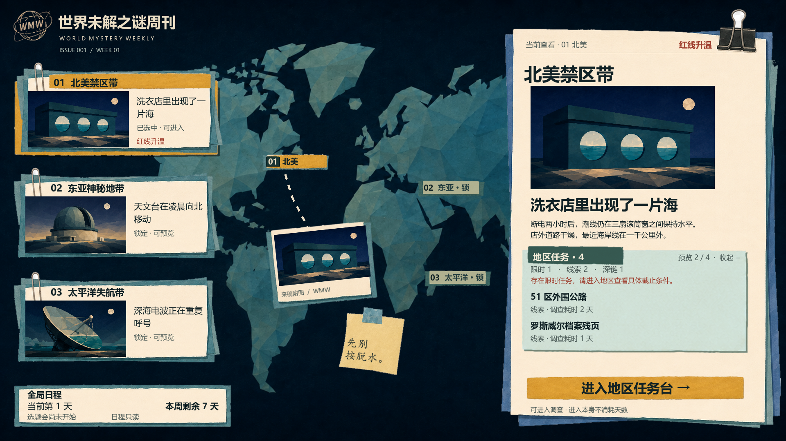

# 文字能放下，不等于图文组合成立

触发：任务列表或信息纸件的文字没有溢出，但标题、图片、耗时、提醒像分别塞入控件，短内容有大空洞，底板像普通报表面板。

## Angus 实例

A363 中用户认为功能基本满足，却指出右下任务区图文与界面资源配合质量低。父级独立分析与传统 UX→UI→UX 路径都发现：固定槽位拆散短标题与耗时，通栏深条、边框、类型竖线叠加后削弱纸物件整体感。传统路径补出了折叠收纸及右栏阅读边线。

A364 按真实行高组织标题与类型/耗时，使用单张浅矿物青任务附页和小标题签；折叠时纸面随内容收短，进入入口保持可达。任务与新闻仍有清楚区分，长内容允许调整承载与照片面积。

依据：[两条路径的分析与限制](../../plans/world-map-benchmark-landing/2026-09-08-task-panel-quality-comparison/README.md)。原运行批次位于原工作目录的 `docs/screenshots/2026-09-08-world-map-task-polish-v5/index.md`，过程目录不随规范迁移；上图已保存独立副本。该图的纸边仍被用户指出有问题并由 A365 接续，因此只用于图文组织案例，不是全部视觉问题通过证明。

## 检查与可选方法

观察真实常态和最拥挤内容：组内是否靠近、组间是否分明；实际纸面是否给文字留位置，夹具与高对比纹理是否侵入。控件矩形、文字可写面和输入热区分别检查。

可以用内容驱动行高、调整纸面承载、改变图文层级或重新拆资产；材料不合适才决定换母件。不要因为最长标题可能换行就让所有短标题永久占满相同行数，也不要默认靠缩字解决容量。

## 限制

小标题签、浅矿物青与固定入口属于该地图目标，不是下一页面的指定配方。极端内容完整可读不能代替常态美术质量。两次分析不是受控模型实验；不能据此认定独立分析普遍胜过协作。
