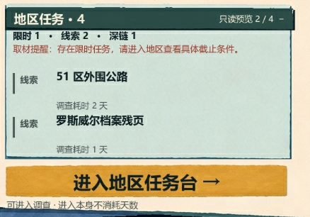

# 任务区组合质量：父级独立分析与传统路径比较

2026-09-08，A363。本轮只做分析与记录，没有修改 Godot、测试、图片或运行几何，也没有生成改后候选。当前用户判断是功能基本满足、视觉组合质量需要改进。

## 当前问题

任务已经能被看见，但文字和素材像分别装进几个控件：标题、分类、红色说明挤在顶部，短任务名与耗时脱开，深条、浅青底、完整边框和黄色按钮各自成立，缺少统一的排版节奏。这是本次两条分析路径都找到的核心原因。

## 两份分析分别提出了什么

**父级独立稿**认为应先重做文字与单张任务纸的承载关系：浅矿物青保留任务识别，小标题签替代通栏深条，去掉完整框和类型竖栏，标题与类型／耗时按真实行数成组。先让常态内容排得好，再兼容长内容；看完整右栏后才决定是否恢复照片权重。旧纸件若不合适再换，不预先为每个问题新增素材。

**传统路径最终方案**为 UX 老哥诊断 → UI Designer 方案 → UX 定向复核。它同样推荐浅矿物青单张任务附页、局部页签和紧凑信息组，并补充统一右栏阅读边线、折叠时附页减高而入口固定、锁定／空态按实际说明撑开纸面。UI 同时提出适度降低地区大标题权重、图片从 430 向约 500 试排；UX 收敛为先满足最长内容，500 不作为目标尺寸或承诺。

## 按结果比较

| 维度 | 父级独立稿 | 传统路径最终稿 | 本次判断 |
| --- | --- | --- | --- |
| 是否找到主因 | 固定槽位拆散内容，纸件用法造成面板感，局部补齐破坏整栏节奏 | 同样确认，且区分可见事实与资源失真的推断 | 主要结论一致，不能说任一方发现了完全不同的根因 |
| 任务如何与新闻区分 | 浅矿物青任务便笺＋小标题签，撤掉重框和通栏深条 | 浅矿物青任务附页＋局部页签 | 最终视觉方向高度接近 |
| 短／长任务内容 | 实际行高，类型和耗时贴标题，组内紧、组间松 | 同样处理，并明确预览前两条不能伪称推荐 | 都可落到实现；传统补充了一项内容语义保护 |
| 折叠与特殊状态 | 保留分类、提醒和固定入口；候选同时看长文案／折叠 | 具体提出收纸减高、固定入口、锁定／空态随内容撑开 | 传统路径更完整，这是有用的增量 |
| 整栏改动范围 | 先修任务与收尾，再判断照片面积；不先确定更大尺寸 | 同时调整地区标题、图片宽度、连续阅读边线；最终承认尺寸需试排 | 独立稿更克制；传统方案的整栏整合更明确，但验证面更大 |
| 素材代价 | 先判断已有纸面能否适配，失败再做新母件 | 倾向提供适配任务的独立纸件，停止标签片段拼大面板 | 暂不必决定先造新资产，先让带真实文字的候选说明问题 |
| 流程增量 | 一份先行诊断已经覆盖主因与主要改法 | 增加了状态处理、整栏重排及交叉检查 | 有补充价值，本次未显示出另一套明显更优的核心美术解法 |

## 父级建议采用的处理方式

本次建议以独立稿的修复范围作为主线，采用传统方案的两个明确补充：**统一右栏阅读边线；收起时任务附页随内容收短而入口固定**。两份最终方案的核心视觉选择相同，不需要硬分成两套完全不同的设计。

下一轮若获实施授权，具体应做成：一张干净的浅矿物青任务附页，配小面积标题签；任务名下紧接类型与耗时；分类和提醒有独立段距；只保留清楚的纸边和少量衬纸；进入按钮及说明作为一个有底部余量的收尾。先完成当前真实短内容和最拥挤长内容的右栏整体候选，再确定纸件是否需更换、图片能恢复多少面积。避免先锁 500px 图片、为腾空间缩字、继续加装饰或直接铺回普通新闻附文。

这次父级单独分析已经抓住主要问题，传统流程的收益主要在补遗漏和收敛实施细节。对这类目标明确的局部质量问题，我更推荐“父级先定完整方案，再让 subagent 检查具体盲点”的用法；这只是本任务的比较判断，不修改全局规则，也不证明独立模式普遍优于多角色协作。

## 比较的公正性与限制

- 父级参与了旧实现，拥有较多历史背景；新 subagent 使用新上下文以减少旧通过结论的影响。因此这不是控制变量齐全的盲测，也没有成本、用时或用户偏好的统计实验。
- 父级初始简报漏写上一轮“任务不能和纯信息一样，否则容易漏看”的原话，UI 初稿因此偏向同暖白纸面＋细线。补齐原话后，UI 主动撤回该局部方案并修订。该输入遗漏归父级，不把初稿当作传统流程更差的证据。
- 传统 UX 初稿提出的计数、预览排序疑问可以查代码：分类按任务 kind 互斥归类，预览沿当前可见节点顺序生成，没有任务优先排序。CTA 固定也可沿用，不需要用户再次确认。这些已经在后续方案中消解。
- 现阶段只能比较诊断依据、改法具体程度、边界与预计代价。没有两套改后成品，不能声称谁的实际美术效果更好。上一轮 57 项检查属于既有功能证据，本轮没有重新运行。
- 先前“无阻止交付问题”只覆盖当时关注的任务发现、文字完整与交互范围，无法证明组合美术质量。父级对常态短内容的大空行与纸件面板感判断不足，已在已有落地记录中修订结论，不甩给 subagent。

## 原稿与执行证据

- [共同题目、路径与输入补齐记录](./00-common-brief.md)
- [父级先行独立稿，保存后未回改](./01-parent-independent.md)
- [UX 老哥第一轮诊断原文](./02-ux-diagnosis.md)
- [UI Designer 初稿与补齐约束后的修订原文](./03-ui-design.md)
- [UX 最终定向复核原文](./04-ux-review.md)

父级先行稿 SHA256：`c3b2fde4196335099ee872f46dc6b6ad11ec5f1b1c37e3e5fcb0409ae5722a32`。先保存并核对该摘要，之后才调用本轮 UX 子代理；结束时再次核对，正文未因传统结果而改写。图像与代码证据路径见共同题目。
