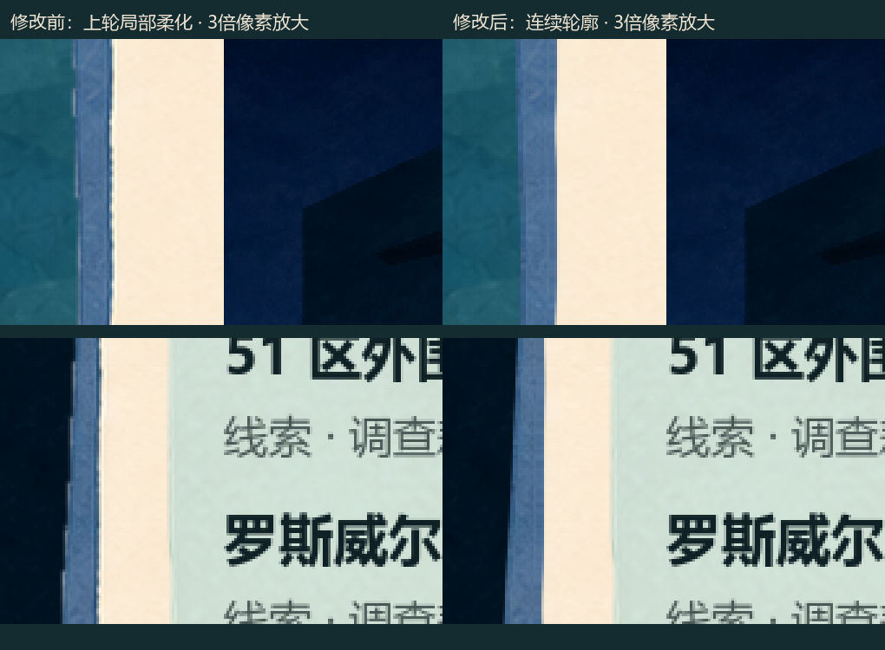
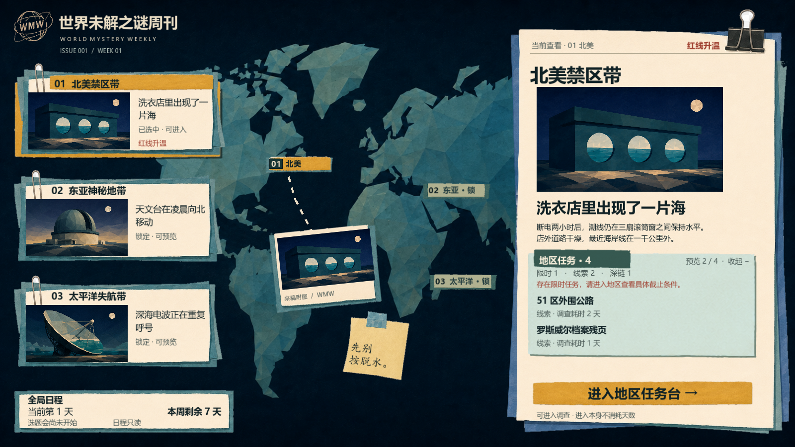

# 右侧底纸左长边修正 · 真实运行证据

用户指出箭头处仍有锯齿后，按其“继续”授权实施。当前为已接入Godot、待用户审阅实际观感。

这次将蓝衬纸外缘和白纸内缘重建为连续轮廓，边缘覆盖率按屏幕像素控制。原PNG、纸纹主体、三处新闻图、文字和交互布局保留；局部交界的取色绕过旧描边，避免留下深色短线。曲线数据由Godot读取原图后计算并缓存，不生成替代美术图。

两条左长边以外，三种尺寸的修改前后截图逐像素一致。原纸件SHA全部一致。11项针对性运行检查、68项原功能回归通过；这不等于用户已确认美术，也不代表所有纸件轮廓均已修正。

本轮只修这张代表件的左长边，顶部夹具、角部和其他纸件沿用既有处理。没有新增动效；下列图是三个真实窗口尺寸，未将1080p截图缩小冒充900p或720p运行。

## 1920×1080 实际运行

[同尺寸修改前](./1920x1080-before.png)

## 1600×900 实际运行

[同尺寸修改前](./1600x900-before.png)

## 1280×720 实际运行

[同尺寸修改前](./1280x720-before.png)

## 检查与过程身份

- [11项针对性检查](./checks.json)、[68项功能回归](./regression/checks.json)、[实图像素范围](./pixel-checks.json)。
- v1为过程样本：边缘取色曾带出旧描边；截图尺寸断言误用了逻辑纹理尺寸。v2修正取色，并以GPU读回图的实际像素检查尺寸。
- 修改前是同一场景关闭连续轮廓、保留上轮局部柔化的状态；不是关闭所有抗锯齿的更差基线。
