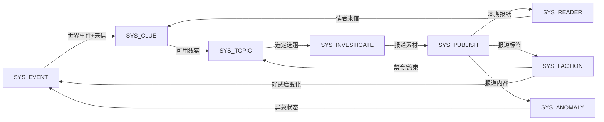

# Case 01 · 《世界未解之谜周刊》系统架构

> **场景**：独立叙事游戏，核心循环已定（获取线索→选选题→调查→出刊→世界反应→新线索）。需要搭建系统架构。

---

## Phase 1 · 核心循环确认

```
获取线索 → 选选题 → 采访/调查 → 出刊 → 世界反应 → 新线索
    ↑                                                    |
    └────────────────── 闭环 ←───────────────────────────┘
```

✅ 闭环完整，每一环有明确的"玩家动作"。

---

## Phase 2 · 四层拆解

### L0 · Game
"每周选题出刊，报道影响城市，城市反馈给你新线索"

### L1 · Module（3 个）

| L1 模块 | 服务循环环节 | 核心体验 |
|---------|------------|---------|
| L1_CONTENT | 获取线索 + 选选题 + 调查 | "我在做调查记者的工作" |
| L1_PUBLISH | 出刊 | "按下发刊按钮的仪式感" |
| L1_WORLD | 世界反应 + 新线索生成 | "我的报道改变了世界" |

### L2 · System（8 个，独立游戏合理范围）

| ID | 系统名 | 所属模块 | 服务环节 | 输入 | 输出 | 优先级 |
|----|--------|---------|---------|------|------|--------|
| SYS_CLUE | 线索系统 | CONTENT | 获取线索 | 世界事件+来信 | 可用线索池 | P0 |
| SYS_TOPIC | 选题系统 | CONTENT | 选选题 | 可用线索+势力约束 | 本期选题列表 | P0 |
| SYS_INVESTIGATE | 调查系统 | CONTENT | 采访调查 | 选题+时间分配 | 报道素材 | P1 |
| SYS_PUBLISH | 发刊系统 | PUBLISH | 出刊 | 报道素材+版面 | 本期报纸 | P0 |
| SYS_READER | 读者系统 | PUBLISH | 读者反馈 | 本期报纸 | 订阅量+来信 | P1 |
| SYS_FACTION | 势力系统 | WORLD | 势力反应 | 本期报纸标签 | 好感度变化+事件 | P0 |
| SYS_ANOMALY | 异象系统 | WORLD | 异象演进 | 报道内容+时间 | 城市异象状态 | P1 |
| SYS_EVENT | 事件系统 | WORLD | 新线索生成 | 势力+异象状态 | 下周线索+来信 | P0 |

---

## Phase 3 · 系统依赖图



**闭环验证**：✅ EVENT → CLUE → TOPIC → INVESTIGATE → PUBLISH → FACTION/ANOMALY → EVENT（完整闭环）

---

## Phase 3 · 资源流转图

### 资源 1：线索（Clue）

```
Source:
  - SYS_EVENT 每期自动产出 3-5 条
  - SYS_READER 读者来信 1-2 条
  - [未来] 线人网络（花金币购买）

Pool:
  - 玩家"线索本"（上限 15-20 条）

Converter:
  - SYS_TOPIC 选题时消费线索 → 变成"选题"

Sink:
  - 选题消费（变成报道后标记已用）
  - 过期淘汰（超过 5 期未用 → 自动过期，释放池位）
```

### 资源 2：好感度（Faction Favor）

```
Source:
  - 正面报道（匹配势力利益 → +1~+3）
  - 沉默（不报相关话题 → 缓慢回正）

Pool:
  - 每势力 [-10, +10] 范围

Converter:
  - 无（好感度不互相转化）

Sink:
  - 负面报道（-1~-3）
  - 势力事件消耗（触发事件后好感度不变但"解锁条件"被消费）
  - 自然衰减（每期向 0 衰减 1 点）
```

### 资源 3：声望/订阅量

```
Source:
  - 精彩报道（+订阅）
  - 独家新闻（+声望）

Pool:
  - 订阅数（0~无上限，但增长递减）
  - 声望值（影响可接触的线人/信息源层级）

Sink:
  - 烂报道（-订阅）
  - 被搜查/禁令（-声望）
  - 时间衰减（长期不出好报道 → 缓慢下降）
```

---

## Phase 4 · 健康度审查

| 检查项 | 结果 | 备注 |
|--------|------|------|
| 每个系统服务核心循环 | ✅ | 8 个系统各有明确环节归属 |
| 无孤立系统 | ✅ | 所有系统都有输入和输出 |
| 资源流有 Sink | ✅ | 线索有过期+消费，好感度有衰减，声望有下降 |
| 无循环依赖死锁 | ✅ | 依赖图是单向循环，无双向互锁 |
| 耦合度 | 🟡 | SYS_PUBLISH 同时输出给 FACTION + ANOMALY + READER 三个系统 → 中度耦合（可接受但注意） |
| 关键路径长度 | ✅ | 最长路径 = 5 系统串联（CLUE→TOPIC→INVEST→PUBLISH→FACTION）≤ 合理范围 |
| Feature 数 | ✅ | 每系统预估 3-6 个 Feature，未超 10 |

### 唯一 ⚠️ 注意点

SYS_PUBLISH 是"扇出节点"（1 输入 → 3 输出）。如果后续 PUBLISH 的输出格式要改 → 3 个下游系统都要适配。

**建议**：定义 PUBLISH 的标准输出格式（如 `{tags:[], tone:"", quality:int, target_faction:""}`）并**锁定接口**，后续只改内容不改格式。

---

## Phase 5 · 最终交付

### 架构概览

```
L0: 世界未解之谜周刊
L1: CONTENT(3) + PUBLISH(2) + WORLD(3) = 8 系统
资源: 线索(15池) + 好感度(±10) + 声望(递增)
闭环: EVENT→CLUE→TOPIC→INVESTIGATE→PUBLISH→FACTION/ANOMALY→EVENT ✅
健康度: PASS（1 个 🟡 耦合点已标注）
```

### 开发优先级建议

```
Sprint 1（可玩原型）: SYS_CLUE + SYS_TOPIC + SYS_PUBLISH + SYS_FACTION
  = 核心循环最小可跑版本（选线索→选题→出刊→势力反应）

Sprint 2（丰富世界）: SYS_EVENT + SYS_ANOMALY
  = 世界有了"自己在变化"的感觉

Sprint 3（深度）: SYS_INVESTIGATE + SYS_READER
  = 调查有过程 + 读者有反馈

Sprint 4（打磨）: 各系统 Feature 补全 + Logic Check 审查
```
